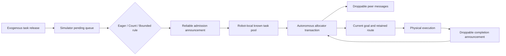

# Simulation and hardware architecture

This is the authoritative architecture for new reallocation-coalescing runs.
The August 14 publication bundle and reports describe the pre-correction
architecture and must not be combined with or used as evidence for a rerun.

## Experimental contract

The experiment isolates the effect of when newly released tasks become
available to otherwise autonomous robot allocators. The simulator owns the
physical world, event clock, release trace, and admission boundary. It does not
choose robot goals, clear allocator state, recall work, or initiate consensus
or recovery decisions.

The primary comparison contains CBAA, ACBBA, PI, and HIPC. Every one of these
allocators sees the complete set of tasks that the individual robot has learned
through admission messages. No Top-K or candidate cap applies.

## Strict admission rules

Released tasks first enter a simulator-held pending queue. Ordinary admission
obeys the selected policy exactly:

- Eager admits one task per epoch. A simultaneous release burst produces
  multiple one-task epochs.
- Count admits exactly `B` tasks whenever the queue reaches `B`. A burst can
  produce multiple exact-`B` epochs; a sub-`B` tail remains pending.
- Bounded admits exact-`B` batches at the threshold. If the oldest pending task
  reaches `W`, the timeout admits the then-pending sub-`B` set.

Task completion, invalid goals, allocator messages, and robot idleness never
piggyback pending work and never bypass `B` or `W`. There is no final-release
flush.

One narrowly defined terminal rule guarantees mission completion for Count
when the last release leaves fewer than `B` tasks. A `terminal_residual` epoch
is allowed only when all of the following are true:

1. no unreleased task remains;
2. the pending queue is nonempty and below the ordinary threshold; and
3. every previously admitted task has been physically completed by the team.

This creates one final residual batch only after the normal experiment has no
other admitted work. It cannot make the bound effectively eager during the
mission.

## Message-only robot knowledge

The world may know every task and its release time, but a robot does not. Even
the time-zero set enters an online robot through the environment's admission
message. A later task coordinate is absent from the robot's snapshot and from
the resident RP2040 target registry until that announcement is delivered.

Admission announcements use the same timestamped bus boundary as other
information but are reliable, because loss would make a policy condition
ill-defined rather than test allocator robustness. Peer allocator, state, and
task-completion messages retain the configured communication delay and loss
behavior. A peer's completion is never inferred by reading shared world state.

Arrival knowledge does not recall a robot. On receipt, the robot records the
new tasks and requests an allocator transaction at its next safe boundary while
preserving its current motion, current goal, claims, and remaining route. If an
announcement arrives while it computes, it is buffered and becomes input to a
later call.

## Allocator behavior

| Allocator | Locally available work | Retained execution state |
|---|---|---|
| CBAA | Bids over the full locally known active pool, but owns/executes one current task at a time | Keeps the won task and its auction-time winning bid until completion, invalidation, recovery release, or an allocator-native outbid |
| ACBBA | Builds an uncapped bundle/path over all locally eligible admitted tasks | Keeps a valid suffix; applies ACBBA's own suffix-release rule when required |
| PI | Builds an uncapped path over all locally eligible admitted tasks | Removes a completed item and preserves the remaining valid path |
| HIPC | Builds an uncapped bundle/path over all locally eligible admitted tasks | Keeps a locally executed suffix; applies HIPC's own peer-completion suffix rule |

Admission is non-destructive for all four allocators. The admission hook may
invalidate an active-set-dependent cache, but it does not clear ownership,
bundles, paths, or the current goal. Completion repair is allocator-specific;
the simulator supplies the locally learned event and does not impose one common
suffix policy.

CBAA does not recompute a retained winning bid as the robot moves. A bid is an
auction-time comparison value, not a continuously changing distance estimate.
Movement only validates that the task and ownership remain active. A genuine
outbid, completion, invalidation, targeted recovery release, or later selection
of a different task can create a new bid. This invariant prevents delayed
messages containing older and newer values for the same retained owner from
forming a feedback loop. Desktop and native implementations must enforce the
same lifecycle.

Because CBAA is inherently a single-assignment auction, a CBAA bundle-length
metric is not comparable to ACBBA/PI/HIPC path length. Cross-allocator response
analysis should use the time from local admission-message receipt to first
selection as the robot's current execution goal. Bundle/claim time remains an
allocator-mechanism diagnostic.

## Final analysis hierarchy

The main scientific tradeoff is **allocator processor work versus task
responsiveness**, subject to mission completion. Analyze it at the trial level
and separately by allocator and arrival load; pooled algorithm means can hide
different consensus and completion-repair costs.

Primary outcomes are:

1. mission completion/failure type;
2. total allocator processor work per mission, using AGX and hardware timing as
   separate treatments;
3. mean release-to-completion latency per trial; and
4. p95 release-to-completion latency per trial for tail responsiveness.

Mission elapsed time is a system-level co-primary or key secondary outcome,
but it is not a substitute for task latency because the final exogenous release
can dominate a sparse mission. Explain the mechanism with admission-epoch
count, timeout/threshold mix, allocator-call count, per-call duration, logical
allocation payload, total team steps, and release-to-first-current-goal
latency. Raw first-claim/reassignment counts are allocator-specific diagnostics
and must not be compared directly between single-task CBAA and bundle/path
allocators.

## Autonomous calls, waiting, and recovery

Robots react to delivered information and local deadlines; they do not poll at
a fixed no-goal interval.

- A robot with no locally known active task sleeps until an admission or other
  relevant message is delivered.
- A robot that locally knows unfinished work but has no goal sleeps until an
  allocator message, completion message, quarantine expiry, or its own stalled
  allocation deadline.
- Consensus, outbid, completion, and invalid-goal calls remain autonomous and
  are not central admission events.

Recovery is a robot-local liveness action. It becomes eligible only after the
robot has continuously known unfinished active work while holding no executable
goal for `stalled_allocation_recovery_s`, measured from its latest locally
observed progress or recovery attempt. The simulator schedules the deadline but
does not choose the repair. The allocator keeps valid state and expires at most
one locally blocking stale peer claim before an ordinary selection/bid. No
global truth is consulted and no full allocator reset occurs.

Recovery can legitimately make no progress when a robot's local information is
consistent but incomplete, for example after a dropped peer-completion message.
Repeated recovery attempts are observable and must not be silently reported as
ordinary allocation calls.

## Causal execution and allocator timing

Each logical robot has an independent virtual processor. The selected timing
provider returns a duration for one frozen allocator transaction, and only that
robot's control path is blocked until `call_start + duration`. Releases,
message deliveries, peer movement, and peer allocator completions continue on
the shared event clock. Inputs that arrive during the interval are buffered for
the robot's next call.

The allocator processor-work boundary is the same on AGX and RP2040. It
includes, in FIFO order:

1. applying queued allocator admission hooks, decoded peer-consensus inputs,
   and completion hooks;
2. allocator-local recovery when requested; and
3. goal selection/bundle repair and bidding.

It excludes radio/USB transport, wire decoding, host/device setup and context
restore, hashing and snapshots, outbound-message construction, serialization,
journaling, and explicit pre-call garbage collection. Admission has no
destructive epoch-reset component; legacy epoch-reset timing fields remain
zero-valued compatibility fields in new output.

`allocator_processor_work_s` is the provider-neutral sum used for comparison.
RP2040-named timing fields are meaningful only for attested hardware calls;
software and zero-duration providers must not populate them as if hardware had
been measured.

## RP2040 replay architecture

The hardware path remains motor-free and keeps persistent native contexts for
the four logical robots. Target slots are appended only when an admission event
reaches that context; a complete future task universe is not sent during trial
setup. Ordered allocator messages, completion hooks, admission hooks, and
recovery requests are staged outside the device timer and executed inside the
next timed allocator transaction. Transport and result extraction remain
outside the timer.

Every accepted physical result must still pass goal, candidate-count, outbound
message, mechanism, and post-state parity against the authoritative AGX call.
Without connected boards, native/loopback tests validate protocol and semantic
architecture only; they are not RP2040 timing evidence.

## Required output checks for a rerun

A valid new trial must show all of the following:

- every ordinary Eager/Count threshold epoch has exactly its configured batch
  size, except a bounded timeout and the single documented terminal residual;
- zero piggybacked admissions and zero `final_release_flush` events;
- per-robot task-knowledge receipt timestamps precede that robot's assignment,
  current-goal selection, and any completion it performs;
- no autonomous call is falsely attributed to a prior admission epoch;
- allocator input-event and recovery counts reconcile with per-call records;
- every required task completes, or the trial retains an explicit algorithmic
  noncompletion without fabricating mission elapsed time; and
- hardware timing is claimed only when device identity and host/device parity
  evidence are present.

Old campaign rows fail this design contract by construction and must remain a
separate historical dataset.

## Legacy configuration guardrails

No existing generated manifest should be mutated or resumed for the rerun.
Several retained standalone-replay selectors intentionally remain broader than
the current study:

- `Simulation/Architecture/allocator_replay/config/study.py` lists DMCHBA/DGA
  and defines a three-task commitment horizon for those legacy paths;
- `Simulation/Architecture/allocator_replay/config/fixture.schema.json` accepts
  DMCHBA/DGA fixtures and the historical `partial_bundle_refill` trigger; and
- `configs/pilot_extended_algorithms.json` is a DMCHBA/DGA-only pilot.

Those values do not cap the four primary allocators in the corrected causal
runtime, but a fresh campaign allow-list must reject them so they cannot enter
the analysis accidentally. No retained JSON campaign configuration contains a
primary-allocator bundle or event-horizon cap; the risk is the broad legacy
selector, not a hidden cap in the current four-algorithm matrices.
