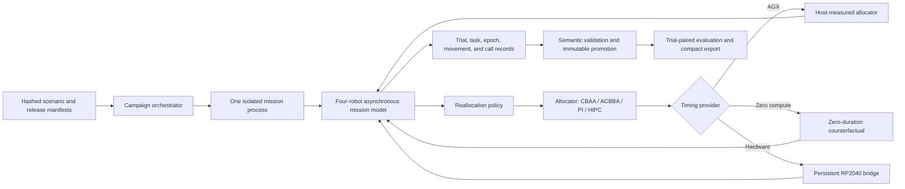
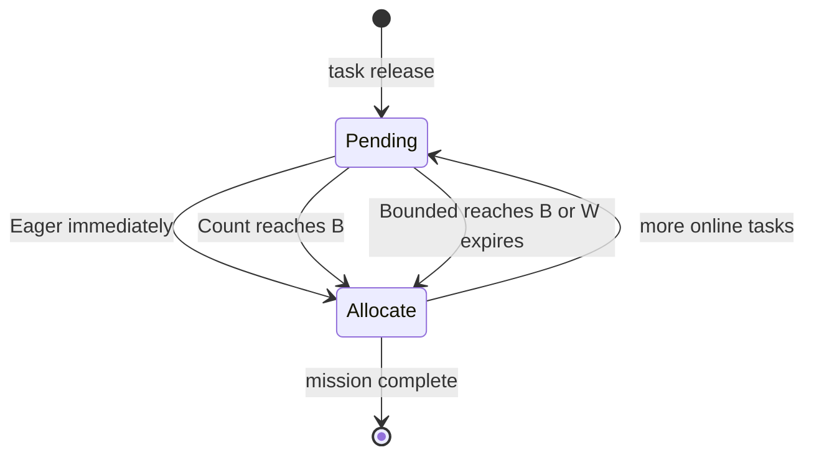
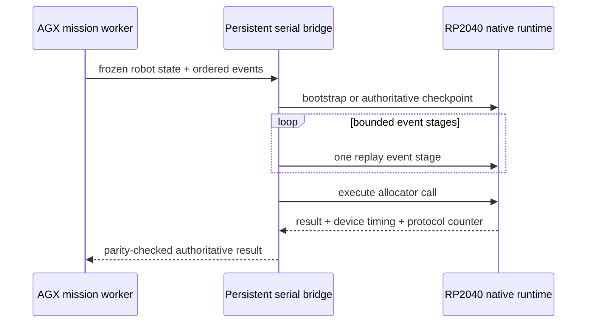
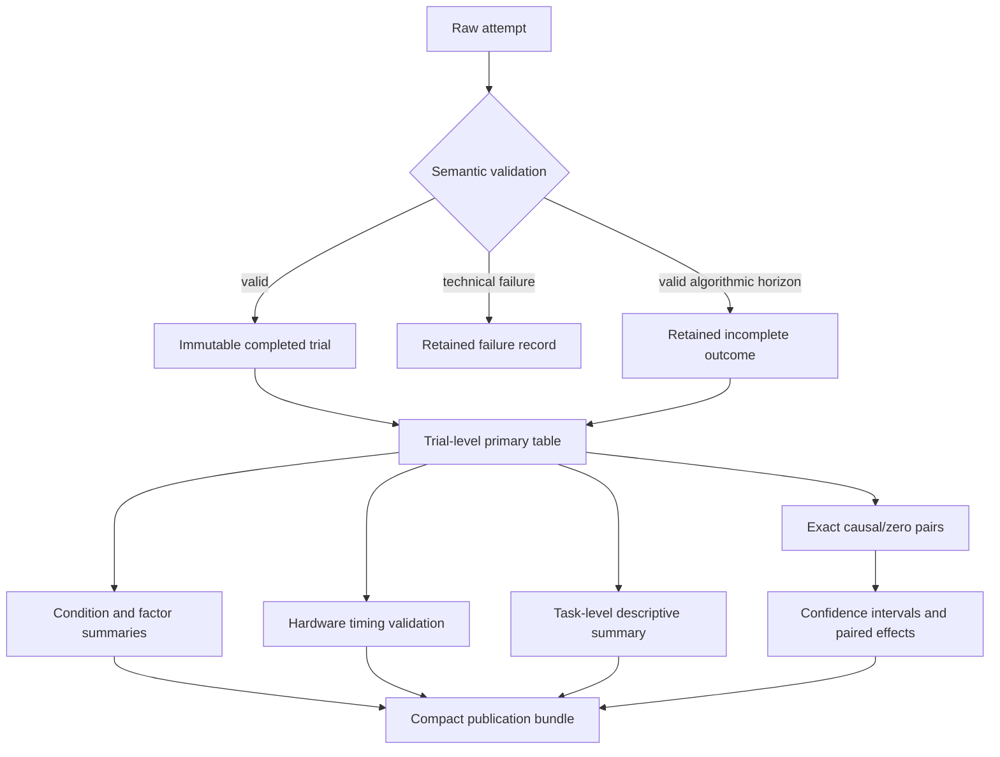

# Simulation and hardware architecture

This document describes the architecture used for the final
reallocation-coalescing experiment and the compact evaluation under
`publication/aug14_final_v1/`.

## System view



The allocator code is independent of the batching policy. The policy controls
when pending online tasks become visible to the allocator; the selected
allocator then assigns or reassigns work using the same mission state contract.

## Experimental dimensions

Each primary timing dataset covers the exact Cartesian product:

- allocators: CBAA, ACBBA, PI, and HIPC;
- arrival loads: low, medium, and high;
- policies: Eager/B=1, Count B=2/4/8, and Bounded B=4/W=5 s;
- traces: 50 paired scenario/release traces;
- four logical robots, a 19x19 grid, and 50 tasks per mission.

This gives 3,000 causal and 3,000 zero-compute trials. For a fixed
`(allocator, load, policy, trace)`, both timing treatments reuse the same
scenario hash, release hash, runtime seed, and movement-timing trace. A selected
104 causal trials obtain allocator durations from three physical RP2040 boards.

## Mission execution

`known_visit_sim` models four logical robots on a shared causal event clock.
Events include task releases, message delivery, allocator availability,
movement completion, and mandatory reallocation points. Inputs that become
available while a robot is computing are retained for a later allocator call;
they do not alter an already frozen input view.

The mission loop is organized around these components:

```text
known_visit_sim/core/scheduler.py       asynchronous mission execution
known_visit_sim/core/reallocation.py    task lifecycle and policy state
known_visit_sim/comms/bus.py            timestamped communication delivery
known_visit_sim/algorithms/              allocator implementations
known_visit_sim/run_causal_trials.py     canonical causal-output adapter
known_visit_sim/run_online_trials.py     AGX campaign entry point
```

Eight tasks are initially visible and 42 arrive online. The movement model uses
deterministic SHA-256-keyed jitter, so timing-provider and policy interleavings
do not consume or reassign random movement draws.

## Reallocation policies



- `eager_b1` exposes every arrival immediately.
- `count_b2`, `count_b4`, and `count_b8` reduce allocation frequency by waiting
  for the indicated pending count.
- `bounded_b4_w5` retains B=4 batching but limits pending age to five simulated
  seconds.
- Mandatory completion/idle epochs can admit pending work, and terminal logic
  prevents a residual partial batch from being stranded.

## Timing providers

All providers implement the same allocator-call interface and return the same
authoritative allocator result shape.

### AGX host proxy

The allocator executes on AGX. `choose_goal` and policy-induced epoch-reset work
are timed separately and combined as allocator processor work. Calls for
different logical robots may overlap on the four-processor mission timeline.

### Zero-compute counterfactual

The same allocator and mission logic execute, but allocator duration added to
the causal clock is exactly zero. Separately recorded AGX diagnostic work is
retained for auditing and is not added to mission time.

### RP2040 hardware

Three physical boards run persistent native allocator contexts through
`Simulation/Architecture/allocator_replay/`. Each mission keeps four logical
robot contexts resident. The host performs authoritative-state setup outside
the measured region, sends bounded event stages, and times native
`choose_goal`/epoch-reset execution separately from USB transport and host
serialization.



Every physical result is compared with the AGX implementation before it is
accepted. Device identity, firmware, module-set hash, source, board assignment,
and CPU affinity are recorded with the output.

## Concurrency on AGX Orin

During the deadline campaign, hardware workers were pinned to CPUs 0-2 and the
rolling AGX-only pool used CPUs 3-8. CPUs 9-11 were reserved for the operating
system, tracking, and supervision. Numerical-library thread counts were forced
to one so a mission process could not silently multiply its CPU use.

Hardware jobs were block-scheduled so both policy members for a paired block
stayed on one board. AGX jobs were condition-balanced and rolled onto the next
free worker rather than assigning a permanently unequal shard to each core.

## Validation, retention, and recovery

An exit code alone never promotes a trial. Before immutable promotion, the
campaign verifies:

- exact job dimensions and scenario/release hashes;
- complete typed output tables and lifecycle timestamp ordering;
- task, epoch, allocator-call, and trigger-count consistency;
- mission and processor-work arithmetic;
- hardware identity and AGX/RP2040 parity where applicable;
- explicit completed or predeclared algorithmic-horizon status.

A technically successful mission that reaches the declared event or stagnation
horizon is retained as an algorithmic noncompletion. It remains in the
completion-rate denominator and has no fabricated final mission time. Technical
attempt failures remain append-only and a successful retry does not erase them.

Successful outputs receive SHA-256 hashes and a `completion.json` marker before
an atomic move into the completed tree. Resume revalidates content rather than
trusting directory presence.

## Output and evaluation layers



Raw per-call and per-epoch tables are intentionally kept outside Git because
they are large working evidence. The final bundle contains one row per trial,
paired differences, condition/factor summaries, descriptive task aggregation,
hardware measurements, verification results, explicit noncompletions, figures,
and a SHA-256 manifest. The paired trial—not an individual task or allocator
call—is the inferential replicate.

## Reproducing the compact export

With the completed campaign roots available locally:

```bash
python -m scripts.agx_build_final_publication \
  --repo-root . \
  --legacy-repo-root . \
  --output publication/aug14_final_v1
```

The exporter refuses missing, duplicate, or incomplete 4x3x5x50 primary
coverage and refuses verification coverage other than the expected 144 trials.
Its generated `publication_manifest.json` hashes every exported file.
